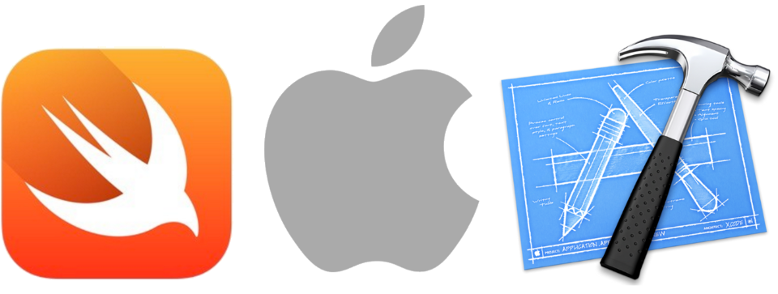

# Demo Swift Text View



This demonstrations shows:

  * The [Swift](http://swift.org) programming language with
    [Apple](http://apple.com) 
    [Xcode](https://developer.apple.com/xcode/)
    [iOS](http://www.apple.com/ios/) 

  * How to create a project with a view.

  * How to create a text view that is wired up with an IBOutlet and with layout constraints.

## Start

To use this demo, you can clone this repo, or you can use this README to create your own project.

If you clone this repo, then be aware that there are multiple git branches, so pick the one you want.

  * **master**: current Swift, Xcode, iOS; currently same content as branch **swift-4-xocde-9**.

  * **swift-4-xcode-9**: Swift version 4, Xcode version 9, iOS version 11.

  * **swift-3-xcode-8**: Swift version 3, Xcode version 8, iOS version 10.


## Create the project

Launch Xcode. 

Choose **File** → **New** → **Project**. 

You see the dialog **Choose a template for your new project**.

  * Choose the **iOS** radio button.

  * Choose the **Single View Application** icon.

  * Tap the button **Next**.

You see the dialog **Choose options for your new project**.

  * For **Product Name**, type **Demo Swift Text View**.

  * For **Organization Name**, type anything you want. Typically this is your company's name, or team's name, or similiar. For example type **Example Company**.

  * For **Organization Identifier**, type anything you want. Typically this is your company's reverse domain name. For example type **com.example**.

  * Tap the button **Next**.

You see the file chooser.

  * Choose where to save your project.

  * Tap the button **Create**.

  * Xcode creates the project.


## Sign the project

If Xcode shows a **Signing** area with a **Status** alert icon, here's how to solve it.

  * Xcode may show a message such as "Signing for "Demo Swift Hello World" requires a development team. Select a development team in the project editor."

  * In the same **Signing** section, choose the **Team** dropdown, and choose your Apple ID.

  * If there's no Apple ID, then you need to add yours: **Xcode menubar** → **Preferences** → **Accounts** → **+** → **Add Apple ID**


## Run the project

Run the project for the first time.

  * **Xcode menubar** → **Product** → **Run**

  * This is simply to verify that the project runs so far.

The Simulator launches.

  * The Simulator shows a blank screen.

  * Quit the Simulator and go back to using Xcode.


## Open the view

Open the view and safe area:

  * In the left Xcode column, tap the icon **Main.storyboard**.

  * In the next Xcode column, tap the icon **View Controller Scene** → **View Controller** → **View** → **Safe Area**.

  * In the central Xcode column, you see the **View Controller** layout area, and the view's safe area is light blue, which means it is selected.


## Add a text view

Add a text view and type some text:

  * In the lower-right Xcode area, there is a library picker, with four icons that have rollover tool tips: **Show the File Template library**, **Show the Code Snippet library**, **Show the Object library**, **Show the Media library**.

  * Tap the circle icon **Show the Object Library**.

  * Drag-and-drop the **Text View** item to the middle of the View Controller layout area.

  * Xcode creates the text view and fills it with example text that says "Lorem Ipsum...".


## Create constraints

Position the text view by adding contraints:

  * Control-tap-press the text view, and drag left. This pops up a menu. Choose **Top Space to Safe Area**. This creates a constraint line from the text view to the top of the safe area.

  * Tap the constraint line. This selects it.

  * In the Xcode upper right area, ther is an **Inspector** area that has icons for **Show File Inspector**, **Show Quick Help Inpsector**, **Show the Identity Inspector**, **Show the Attributes Inspector**, **Show the Size Inspector**, **Show the Connections Inspector**.

  * Tap the icon **Show the Attributes Inspector**. You should see the attributes, including a section that says **Top Alignment Contraint**.

  * See the **Constant** field. Edit the field value. Set it to **0**

  * Do the same as above for Control-tap-press drag left, **Leading Space to Safe Area**, **Constant** **0**.

  * Do the same as above for Control-tap-press drag right, **Trailing Space to Safe Area**, **Constant** **0**.

  * Do the same as above for Control-tap-press drag down, **Bottom Space to Safe Area**, **Constant** **0**.

Update frames:

  * In the central Xcode column, in the lower right area, tap the icon that is a refresh circle arrow, with the tool tip **Update Frames**. Tap it.

  * You see the text view change size to be its correct size, which is flush with the safe area.


## Create the IBOutlet

Look in the right place.

  * Open your storyboard **Main.storyboard**.

  * Tap the **Assistant** button in the Xcode toolbar near the top right corner of Xcode to open the assistant editor.

  * In the editor selector bar, which appears at the top of the assistant editor, the assistant editor text should say **Automatic** → **ViewController.swift**. If the text is different, such as saying **Preview**, then tap the text to change it.

Create a new IBOutlet and connect it.

  * Control-drag from the text view on your canvas to the code display in the editor on the right, stopping the drag at the line below the line that starts with `class ViewController`.

  * A dialog appears, that shows **Connection** is **Outlet**, **Object** is **ViewController**, **Name** is **blank**, **Type** is **UITextView**, **Storage** is **Weak**.

  * In the **Name** field, type **demoTextView**.

  * Tap Connect.

Xcode adds the necessary code.

  * The code looks like this: `@IBOutlet weak var demoTextView: UITextView!`

  * Xcode configures the storyboard to set up the connection.

  * Xcode adds code to ViewController.swift to store a pointer to the text view.


## Say hello

Edit the code of **ViewController.swift**, in the function `viewDidLoad`:

```swift
override func viewDidLoad() {
  super.viewDidLoad()
  demoTextView.text = "Hello World"
}
```
		
## Run

Run the project.

  * **Xcode menubar** → **Product** → **Run**

The Simulator launches.

  * The Simulator shows "Hello World".

  * Congratulations! You're successful!


## Complete source

The ViewController.swift code complete source looks like this:

```swift
import UIKit

class ViewController: UIViewController {

  @IBOutlet weak var demoTextView: UITextView!
  
  override func viewDidLoad() {
    super.viewDidLoad()
    demoTextView.text = "Hello World"
  }
	
  override func didReceiveMemoryWarning() {
    super.didReceiveMemoryWarning()
  }

}
```

## Aside: if you prefer to use a Text Field

If you prefer to use a Text Field instead of a Text View, then you can generally use the same instructions as above, then do the additional items in this section.

Show the attributes:

  * Tap the text field to select it.

  * If the **Attributes Inpector** is not currently showing, then tap the icon **Show Attributes Inspector**.

Set placeholder text:

  * **Attributes Inpector** → the section **Text Field** → the label **Alignment** → the icon areas for **Horizontal** and **Vertical**.

Control aligment: 

  * Tap the text field to select it.

  * **Attributes Inpector** → the section **Control** → the label **Alignment** → the icon areas for **Horizontal** and **Vertical**.

  * For horizontal alignment, tap the icon **Left**.

  * For vertical alignment, tap the icon **Top**.


## Tracking

* Package: demo_swift_text_view
* Version: 4.0.0
* Created: 2016-04-09
* Updated: 2017-09-27
* License: BSD, GPL, MIT
* Contact: Joel Parker Henderson (http://joelparkerhenderson.com)
